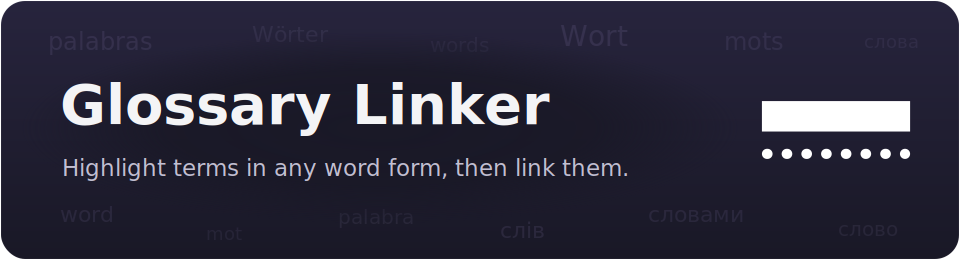

<p align="center">
  
</p>

# Glossary Linker

<p align="center">
  <a href="https://community.obsidian.md/plugins/glossary-linker"></a>
  <a href="https://github.com/max-fluff/obsidian-glossary-linker/releases/latest"></a>
  <a href="LICENSE"></a>
</p>

Highlights glossary terms in your notes in any word form (declensions, plurals), lets you turn them into real links, and picks up new aliases from links you've already made by hand. It was inspired by Virtual Linker, but it matches inflected forms instead of exact spellings only.

Available in the Obsidian community catalog: **[community.obsidian.md/plugins/glossary-linker](https://community.obsidian.md/plugins/glossary-linker)**.

<p align="center">
  
</p>

The plugin ships as `main.js`, `manifest.json` and `styles.css`. Six language modules are baked into `main.js`, so it works the moment you install it. You can add more languages as modules (see [Adding a language](#adding-a-language)). `main.js` is built from `src/` with esbuild (see [Development](#development)).

## Contents

- [What it does](#what-it-does)
  - [Highlight terms in any word form](#highlight-terms-in-any-word-form)
  - [Turn terms into real links](#turn-terms-into-real-links)
  - [Collect aliases from links you made](#collect-aliases-from-links-you-made)
  - [Suggest links as you type](#suggest-links-as-you-type-optional)
  - [Ambiguous terms](#ambiguous-terms)
  - [Glossary overview](#glossary-overview)
- [Morphology and languages](#morphology-and-languages)
  - [Which scripts fit](#which-scripts-fit)
  - [Adding a language](#adding-a-language)
- [Commands](#commands-command-palette-ctrlp)
  - [Templates for new terms](#templates-for-new-terms)
- [Settings](#settings)
- [Skipped contexts](#skipped-contexts)
- [Performance](#performance)
- [Public API](#public-api)
- [Licenses & credits](#licenses--credits)
- [Development](#development)
- [Installation](#installation)
- [Compatibility](#compatibility)
- [Related plugins](#related-plugins)

## What it does

### Highlight terms in any word form

The term list comes from each glossary file's name and its `aliases`. Matching words are found even when inflected (`unit → units`, RU `юнит → юнита/юниту/юнитов`). The engine is multilingual and picks itself by the word's script: Russian for Cyrillic, English for Latin (more in [Morphology and languages](#morphology-and-languages)). Highlighting runs in Reading view and in the editor (Live or On save). Multi-word terms (`Vision radius`, hyphenated `Flow-field`) match as a whole, longest match first.

The highlights behave like real internal links, in both Reading view and the editor:

- hover shows the term's page preview (following your *Page Preview* settings, with or without a modifier key);
- click opens the glossary note — in the editor a plain click just places the cursor, Ctrl/Cmd+click follows the term, and middle-click opens it in a new tab;
- right-click opens an actions menu — link to term, exclude the word or term, open the note, and more (see [Commands](#commands-command-palette-ctrlp)). Each group can be hidden under *Settings → Context menu*; with all off, right-click shows the native menu. On mobile, a long-press opens this menu (there's no hover preview).

<p align="center">
  
</p>

### Turn terms into real links

There are commands for the current note, the selection, or every note. A matching word becomes `[[Title|word]]`: the visible text stays exactly as you wrote it, and the link points to the glossary title. An "only first match per note" option is available, and every change is previewed before it's written.

<p align="center">
  
  <br><sub>Every change is previewed before it's written.</sub>
</p>

Same words before and after — the visible text is unchanged, only the link is added:

<div align="center">
<table>
<tr>
<td></td>
<td></td>
</tr>
<tr>
<td align="center"><sub>Before — highlighted, text still plain</sub></td>
<td align="center"><sub>After — real links</sub></td>
</tr>
</table>
</div>

<details>
<summary>Vault-wide preview (all notes)</summary>

<p align="center">
  
</p>

Across the whole vault, replacements are grouped by file, with a single picker at the top for any word that matches more than one term.

</details>

### Collect aliases from links you made

This scans for `[[Term|some wording]]` links you wrote by hand. If `Term` is a glossary note and the wording is custom, that wording becomes a new alias for the term; inline code and emphasis (`` `code` ``, *italics*) are stripped from it first. By default the wording is reduced to a base form (`[[fruit|fruits]] → fruit`). Aliases are de-duplicated case-insensitively, and nothing is added if the term already matches that wording anyway. Run it as a command or automatically on save. The preview gives each alias a checkbox, flags aliases that would collide with another term with ⚠ and leaves those unchecked, and lists separately the candidates skipped for already existing. A silent (on-save) collect skips colliding aliases entirely.

<p align="center">
  
</p>

**Alias form** (`aliasHarvestMode`) controls how the collected wording is stored:

- **`lemma`** (default) — reduce the wording to a base (dictionary) form: EN `boxes → box`, RU `роем → рой`, `юнитов → юнит`. RU soft-stem nouns (`боем → бой`) have a dedicated rule; irregular alternations may still need a manual fix in the preview.
- **`literal`** — store the wording as written.
- **`both`** — store both.

### Suggest links as you type (optional)

Turn on *Autocomplete → Suggest links while typing* and typing in an in-scope note offers to insert a `[[link]]` to a matching glossary term. The match can be a prefix of a term's title or alias (type `Vis` → *Vision radius*) or an inflected form of one. A prefix match inserts `[[Term]]`; an inflected form keeps your wording as `[[Term|word]]`. It's off by default and never fires inside the glossary folder, code, links or other protected spans. It also stays quiet when the word follows a sigil like `@`, `#` or `$`, so it doesn't fight tags, math or another plugin's autocomplete — see *Skip after characters*.

<p align="center">
  
</p>

### Ambiguous terms

When a word matches more than one glossary term (the same alias lives on two notes), it gets a distinct double underline, and hovering shows a tooltip listing every matching term instead of a single, misleading page preview. Acting on it — clicking to open, or *Link to term* / *Open* from the right-click menu — opens a small picker so you choose which term rather than silently following the first. A word that matches a single term acts immediately, as usual.

Each row in the tooltip and the picker carries a second line saying what it is, and — when the word reached that term through one of its aliases rather than its title — which alias. That last part matters when an alias on one term collides with another term's title: you interact with "A", the list offers "A" and "B", and the line under "B" says it answers to "A" as well.

<p align="center">
  
  <br><sub>A word that fits two terms gets a distinct underline and a tooltip listing them.</sub>
</p>

<p align="center">
  
  <br><sub>Acting on it asks which term you meant.</sub>
</p>

### Glossary overview

A right-sidebar panel (the *Open glossary overview* command, or the ribbon icon) for the whole glossary at once, in two lists:

<p align="center">
  
</p>

- **Terms** — every indexed term with how often it's used across in-scope notes; sort by usage or by name. The count is plain-text mentions, plus existing `[[Term]]` links when *count links* is ticked (on by default — so a term you've already linked everywhere isn't mistaken for unused). Terms with no uses are flagged as orphans. Click a term to open it (middle-click for a new tab), or use *link all* to link its occurrences across the vault.
- **Candidates** — frequent words that are *not* terms yet, so you can spot what's worth defining. Each shows how many notes it appears in and its total uses; sort by either, and set the *Min notes* threshold in the panel. Per candidate: create a term from it, or dismiss it with ✕ (which adds it to *Excluded words*, so it stays out of future scans). Collapse the section to skip the (heavier) candidate scan.

Both lists come from scanning your notes, so they refresh on demand — hit *Rescan* after a round of edits. By default the scan follows the linker's [Link scope](#settings); tick *whole vault* in the panel header to scan every note regardless of scope.

## Morphology and languages

Morphology is modular. Six language modules are bundled in by default, and you can add more and rebuild (see [Adding a language](#adding-a-language)). Each one is validated against the module contract on load and gets a toggle in settings (*Matching → Languages*). For a given word, the keys from every enabled language that claims it are combined, so same-script languages like English, Spanish, German and French all contribute on a Latin word. If no language claims a word, it's matched exactly (lowercased), with no morphology.

The built-in modules are stemmer code compiled into the plugin:

- `ru.js` (Russian) — Porter stemmer (Snowball, public domain). The keys are the union of the Porter stem and an ending strip, dropping an over-short stem. That covers both awkward cases: `юнит/юнитов` (the stemmer over-truncates to `юн`, the ending strip rescues `юнит`) and `рой/роем`, while `юный/юнга/юности` don't stick to `Юнит`.
- `uk.js` (Ukrainian) — the plugin's own light stemmer, handling the о/і and е/і vowel alternation in closed syllables (`кіт/кота`, `ніч/ночі`).
- `en.js` (English) — Porter stemmer (Porter 1980, public domain): `units → unit`, `running → run`.
- `es.js` / `de.js` / `fr.js` (Spanish / German / French) — ports of the UniNE / Apache Lucene light stemmers (Apache License 2.0, J. Savoy): `unidades → unidad`, `Einheiten → einheit`, `chevaux → cheval`. Lighter than full Snowball, but enough to link a term across its word forms.

> Enable only the languages your vault actually uses. Since same-script languages combine, leaving German on in an English-only vault can occasionally over-stem a word. On first run the plugin enables English plus your Obsidian interface language (if a module exists for it); switch on any others you need.

The mode (`matchMode`) is a global switch for all languages: `stemmer`, `endingStrip` (a light ending trim), or `exact`. Each mode's actual algorithm comes from the language module. A separate setting, *Alias form* (`aliasHarvestMode`), controls how *collected* aliases are stored — see [Collect aliases from links you made](#collect-aliases-from-links-you-made).

### Which scripts fit

The matcher splits text into words (Unicode `\p{L}`/`\p{Nd}`) and reduces each one by trimming endings, so it fits alphabetic scripts with word separators and suffix inflection: Latin, Cyrillic and Greek fit fully, and Indic abugidas and Korean fit where a module strips suffixes or particles. It does not fit spaceless CJK or root-and-pattern scripts like Arabic and Hebrew, which need word segmentation or substring search that the core doesn't do.

Matching ignores case, except for terms that look like acronyms — see *Smart case for acronyms* below. The visible text keeps the casing from your note, and collected aliases are stored lowercased.

### Adding a language

A language is a small JavaScript module bundled into `main.js` at build time; nothing is loaded or executed at runtime. The modules are shared with the sibling linker plugins, so they live in the [obsidian-linker-shared](https://github.com/max-fluff/obsidian-linker-shared) submodule and a new one benefits every plugin at once. Adding one means contributing a module and rebuilding, through a pull request (see [Contributing](CONTRIBUTING.md)). The full contract, an annotated template and a step-by-step guide live in [`languages/README.md`](src/shared/morphology/languages/README.md). The short version:

1. Copy [`_template.js`](src/shared/morphology/languages/_template.js) to `src/shared/morphology/languages/<id>.js` (e.g. `uk.js`). A module exports `id`, `name`, `match(word)` and `keys(word, mode)`, plus optional `priority` and `lemma(word)`. Reusing a built-in `id` (`ru`/`uk`/`en`/`es`/`de`/`fr`) overrides it.
2. Implement `match` (claims a word, usually by script) and `keys` (returns the comparison keys for a word in the current mode — `stemmer` / `endingStrip` / `exact`). Two words link when their key sets overlap.
3. Register the module in [`builtin-languages.js`](src/shared/morphology/builtin-languages.js) and run `npm run build`.
4. Restart the plugin. The language shows up under *Matching → Languages*; turn its toggle on.

Every module is validated against the contract on load (`src/shared/morphology/language-api.js`). A module that doesn't export an object with a valid `id` / `name` / `match` / `keys` is dropped and listed under *Languages* with a ⚠ marker and the reason, so the index keeps working and a mistake is easy to spot.

## Commands (command palette, Ctrl+P)

- **Link glossary terms: this note / selection / all notes**
- **Unlink glossary terms: this note / selection / all notes** — the reverse of *Link glossary terms*: each `[[Title|word]]` pointing at a glossary note becomes plain `word` again, previewed first. Links inside code or frontmatter, links you wrote to a specific heading (`[[Term#section]]`), and links to non-glossary notes are left untouched.
- **Collect aliases from links: this note / all notes**
- **Create glossary term from selection** — creates a note in the glossary folder named after the selected text, and links the selection to it
- **Open glossary overview** — the right-sidebar panel (see [Glossary overview](#glossary-overview))
- **Rebuild glossary index**


### Priority among linker plugins

Install more than one linker and they will sometimes claim the same word or the same link. It goes to whichever sits highest in **Settings → Maintenance → Priority among linker plugins**, and the loser stands aside — no double highlight, one entry in the right-click menu, one merged list of suggestions while you type.

The list appears only when another linker is installed. Each plugin moves itself, so reordering may take a move from more than one settings tab; every arrangement is reachable that way.

You can also act on a highlighted term from its right-click menu: *Link to term*, *Link all "…" to term: this note*, *Link all "…" to term: all notes* (the last previews changes across the whole vault), plus *Add "…" to excluded words* / *Add "…" to excluded terms* to quickly suppress a false match. Each exclude item is reversible: right-click a word or link that's already excluded and the same item reads *Remove "…" from excluded words / terms*. Right-click an existing glossary **link** for *Glossary: unlink this term* (turn just that link back into plain text) and *Glossary: collect this alias* (add this one link's wording as an alias for its term). Right-click a plain-text **selection** for *Glossary: create term & link* (create the term note and replace the selection with a link), *Glossary: create term* (just create and open it), and *Glossary: add "…" to excluded words* (suppress that word, term or not). Right-click anywhere else in the editor — empty space or a link — for *Glossary: collect aliases from links (this note)*. Each of these groups can be toggled off under *Settings → Context menu*.

A status-bar counter (e.g. `3 terms`) shows how many glossary terms are on the current note: plain-text mentions plus, optionally, terms already linked directly. Click it to link this note's terms (toggles under *Highlighting → Status bar count*).

### Templates for new terms

A new term is a blank note by default. Set *Term template* to a note path to use that note as the body instead. These tokens are filled in when the term is created:

- `{{title}}` — the term name
- `{{selection}}` — the text you selected
- `{{source}}` / `{{sourcePath}}` — the note the term was created from
- `{{date}}`, `{{time}}` — current date/time; pass a [moment](https://momentjs.com/docs/#/displaying/format/) format as `{{date:YYYY-MM-DD}}`

`{{title}}` is the selection with characters that aren't allowed in file names stripped out, so it matches `{{selection}}` for an ordinary word and differs only when the selection contains such characters.

These are the same tokens the core Templates plugin uses, so a Templates file works here too. Frontmatter in the template (an empty `aliases:` list, say) carries over as-is. The folder and file name come from the plugin, not the template, since the file name is the term.

To use [Templater](https://github.com/SilentVoid13/Templater) instead, leave *Term template* empty and add a Templater folder template for the glossary folder. The plugin creates a blank note and Templater fills it. Use one or the other for a folder, not both.

## Settings

Settings are grouped into sections, each with a short description in the UI. The tables below carry the full details and tips.

**Scope**
| Setting | Default | Description |
|---|---|---|
| **Glossary folder** | `glossary` | folder with the term notes (created automatically when aliases are written if it is missing); has folder autocomplete, and shows a warning / indexed-term count below it |
| **Term template** | — | note used as the body of new term notes; tokens like `{{title}}` / `{{selection}}` / `{{date}}` are filled in (see [Templates for new terms](#templates-for-new-terms) above); empty = blank note |
| **Link scope** | `Everywhere` | `Listed paths only` (an allow-list) or `Everywhere`. To link everywhere *except* a few folders, use `Everywhere` and list them under Always-excluded below |
| **Paths to include** | — | path list (file or folder); only these are in scope. Shown only in `Listed paths only` mode |
| **Always-excluded paths** | — | always out of scope, on top of the mode above |

You can also manage these lists from the file explorer: right-click a file or folder for *Glossary: add to always-excluded* (and the reverse once it's listed), or — in *Listed paths only* mode — *Glossary: include in scope*.

**Matching**
| Setting | Default | Description |
|---|---|---|
| **Morphology** | `Stemmer` | how an inflected word is matched: `Stemmer` reduces words to a root (units → unit, recommended); `Ending strip` only chops common endings (lighter); `Exact match` needs the exact spelling. The algorithm itself comes from the enabled language modules |
| **Minimum term length** | `2` | ignore term titles and aliases shorter than this many characters, so single letters don't match everywhere |
| **Smart case for acronyms** | on | a term written mostly in capitals ("IT", "NASA") only matches text spelled the same way, so it leaves the ordinary word alone. Decided per form: an acronym alias stays case-sensitive even when its term is an everyday word |
| **Languages** | English + interface language | per-language toggle; reorder with ↑↓ to set priority (higher in the list wins when same-script languages overlap, deciding the lemma); on first run only English and your Obsidian interface language are enabled |
| **Link first occurrence only** | off | link only the first occurrence of each term per page |
| **Excluded terms** | — | term titles or aliases that drop the whole matching entry from the index; a shared alias (e.g. `_toc` on every index/MOC note) drops them all at once. Use *Excluded words* to suppress a single word |
| **Excluded words** | — | surface words (and their inflections) that never trigger a link even if they match a term — for homonyms, e.g. a common word "lead" colliding with a term "Lead" |

**Highlighting**
| Setting | Default | Description |
|---|---|---|
| **Highlight in Reading view** | on | underline detected terms as clickable links in Reading view (file unchanged); they behave like real links — hover preview, click to open, right-click for the actions menu |
| **Highlight while editing** | `Live` | editor highlighting: `Off` / `Live (as you type)` / `On save`; applied immediately, no reload |
| **Skip headings** | on | do not link inside headings (`#`) |
| **Status bar count** | on | show the count of terms on the current note (e.g. `3 terms`) in the status bar; the base count is plain-text (not-yet-linked) mentions; click it to link them |
| **Count direct links** | on | also count terms already linked directly (`[[Term]]` / `[[Term\|alias]]`), not just plain-text mentions |

The highlight's color and underline style — plus a separate underline for ambiguous terms — are exposed to the [Style Settings](https://github.com/mgmeyers/obsidian-style-settings) plugin under a *Glossary Linker* section, so you can restyle them from a UI. Without Style Settings, or left at default, the highlight follows your theme's link color with a dotted underline.

<p align="center">
  
</p>

**Autocomplete**
| Setting | Default | Description |
|---|---|---|
| **Suggest links while typing** | off | offer a `[[link]]` to a matching term as you type in an in-scope note (prefix of a title/alias, or an inflected form); only triggers at the end of a word and only when there are matches |
| **Minimum characters** | `3` | how many characters to type before suggestions appear |
| **Skip after characters** | `@#$^` | stay quiet when the word follows one of these, so tags, math, and other plugins' autocompletes (e.g. Code Linker's `@@`) keep their slot; clear it to disable |
| **Insert plain text** | off | pick a suggestion and get the word alone instead of a link — the completion without the brackets |

**Collecting aliases**
| Setting | Default | Description |
|---|---|---|
| **Alias form** | `Base form` | how link text is stored: `Base form` reduces it to a dictionary form so one alias covers many word forms ("boxes" → "box"; it is a stem, so it can be grammatically odd but still matches); `As written` keeps the exact text; `Both` stores both |
| **Collect on save** | `Off` | `Off` / `Silent (add automatically)` / `Ask first` — collect aliases on save (with a short delay) |
| **Single-word aliases only** | on | collect single-word link texts only (multi-word ones reduce poorly) |
| **Minimum alias length** | `2` | ignore aliases shorter than N characters |
| **Warn about alias collisions** | on | when collecting an alias or creating a term, flag wording that already matches a different term, so you don't make one word point at two terms |

**Context menu**
| Setting | Default | Description |
|---|---|---|
| **"Link to term" items** | on | show the link-to-term actions when right-clicking a term |
| **"Collect aliases" item** | on | show *Glossary: collect aliases from links (this note)* in the editor menu (empty space / a link) |
| **"Exclude word / term" items** | on | show *Add … to excluded words / terms* when right-clicking a term |
| **"Open glossary note" items** | on | show *Open glossary note* / *Open in new tab* when right-clicking a term (all groups off → native menu) |
| **"Create term from selection" items** | on | show the *Glossary: create term…* actions when right-clicking a selection |
| **"Unlink term" item** | on | show *Glossary: unlink this term* when right-clicking an existing glossary link |

**Overview**
| Setting | Default | Description |
|---|---|---|
| **Ribbon icon** | on | show a ribbon button that opens the [Glossary overview](#glossary-overview) panel; the *Open glossary overview* command works either way |

The candidate threshold (*Min notes*) and the term sort live in the panel's own header, not here.

## Skipped contexts

Code blocks (``` and `~~~`), inline code, frontmatter, existing `[[...]]` and `[..](..)` links, and URLs are left untouched. A term is never linked inside its own note. In Reading view, links and (optionally) headings are skipped by DOM ancestry; in the editor, by the CM6 syntax tree. When a link is written into a Markdown table cell, the alias pipe is escaped (`[[Term\|word]]`) so the table isn't broken.

## Performance

The index is built on load and rebuilt when glossary notes change (debounced). Word-form keys are cached in the index, and per-word stemmer results are memoised across a render pass (invalidated on rebuild). Scanning is token-based with longest-match-first. The editor's right-click menu reads the term straight from the clicked decoration instead of re-scanning the document.

## Public API

The plugin exposes a small read-only API at `app.plugins.plugins['glossary-linker'].api`, so other plugins and DataviewJS can query the glossary:

| Method | Returns |
|---|---|
| `getTerms()` | every indexed term: `{ canonical, path, aliases }` |
| `resolveTerm(name)` | the term a title or alias (case-insensitive) belongs to, or `null` |
| `keysFor(word)` / `lemmaFor(word)` | the morphology keys / base form of a word, same engine the matcher uses |
| `findMatches(text)` | glossary matches in arbitrary text (protected spans skipped) |
| `getUsageReport(opts?)` | async; per term, how many occurrences across in-scope notes and in which files — terms with `count: 0` are orphans. Counts plain-text mentions; pass `{ includeLinks: true }` to also count direct `[[Term]]` links |
| `collectCandidates()` | async; frequent in-scope words that are not yet terms: `{ lemma, display, count, docFreq }`, ordered by how many notes they appear in |
| `onChange(cb)` | subscribe to index rebuilds; returns an unsubscribe function |

A "glossary dashboard" in DataviewJS, for example:

```js
const api = app.plugins.plugins['glossary-linker'].api;
const report = await api.getUsageReport();
dv.table(['Term', 'Uses'], report.sort((a, b) => b.count - a.count).map((r) => [r.canonical, r.count]));
// orphans:
dv.list(report.filter((r) => r.count === 0).map((r) => r.canonical));
```

## Licenses & credits

Most bundled language modules port well-known, permissively-licensed stemming algorithms (`uk.js` is the plugin's own, under its MIT license). All are free for commercial and non-commercial use; the only obligation is keeping the attribution notices, which are already in each file's header.

| Module | Algorithm | License | Reference |
|---|---|---|---|
| `ru.js` | Snowball Russian stemmer (Porter framework) | BSD (© 2001–2006 M. Porter & R. Boulton) | [snowballstem.org](https://snowballstem.org/algorithms/russian/stemmer.html) · [license](https://snowballstem.org/license.html) |
| `uk.js` | Light suffix stemmer with vowel alternation | MIT (this plugin) | — |
| `en.js` | Porter stemmer (M. F. Porter, 1980) | Free use, released by the author | [tartarus.org](https://tartarus.org/martin/PorterStemmer/) |
| `es.js` | Apache Lucene `SpanishLightStemmer` (UniNE, J. Savoy) | Apache License 2.0 | [source](https://github.com/apache/lucene/blob/main/lucene/analysis/common/src/java/org/apache/lucene/analysis/es/SpanishLightStemmer.java) |
| `de.js` | Apache Lucene `GermanLightStemmer` (UniNE, J. Savoy) | Apache License 2.0 | [source](https://github.com/apache/lucene/blob/main/lucene/analysis/common/src/java/org/apache/lucene/analysis/de/GermanLightStemmer.java) |
| `fr.js` | Apache Lucene `FrenchLightStemmer` (UniNE, J. Savoy) | Apache License 2.0 | [source](https://github.com/apache/lucene/blob/main/lucene/analysis/common/src/java/org/apache/lucene/analysis/fr/FrenchLightStemmer.java) |

The es/de/fr stemmers were translated to JavaScript and adapted to this plugin's module interface; per the Apache License the source files note that they are modified ports. Apache 2.0 full text: <https://www.apache.org/licenses/LICENSE-2.0>.

Glossary Linker itself is released under the MIT license — see [`LICENSE`](LICENSE).

## Development

The core is written as small CommonJS modules in `src/` and bundled into `main.js` by esbuild. The language modules live in the shared submodule, under `src/shared/morphology/languages/`, and are bundled in through `src/shared/morphology/builtin-languages.js`; adding a language means contributing a module there and rebuilding (see [`languages/README.md`](src/shared/morphology/languages/README.md)). Nothing is loaded or executed at runtime.

Generic code shared with the sibling linker plugins lives in `src/shared/`, a git submodule of [obsidian-linker-shared](https://github.com/max-fluff/obsidian-linker-shared). Clone with `--recurse-submodules` so the build can find it:

```
git clone --recurse-submodules https://github.com/max-fluff/obsidian-glossary-linker
npm install      # once, installs esbuild
npm run build    # bundle src/ -> main.js
```

In an existing clone without the submodule, run `git submodule update --init` first.

`src/` layout:

- `main.js` — the `Plugin` class: lifecycle, commands, language loading, scope, small shared helpers; applies the mixins below.
- `constants.js` — default settings.
- `matcher.js` — the term index and matching engine (`keysFor`, `tokenizeForm`, `rebuildIndex`, `findMatches`, `termsMatchingText`, protected ranges).
- `highlight.js` — Reading-view DOM highlighting and the CM6 editor extension.
- `actions.js` — turning terms into links and collecting aliases.
- `api.js` — the public API mixin (`app.plugins.plugins['glossary-linker'].api`).
- `modals.js` — the preview dialogs and the confirm dialog.
- `settings-tab.js` — the settings UI.
- `folder-suggest.js` — folder autocomplete for the glossary-folder field (feature-detected).
- `term-suggest.js` — the editor autocomplete (`EditorSuggest`, feature-detected).
- `shared/` — git submodule shared with the sibling linker plugins: markdown helpers, the i18n engine, the folder-list settings editor, and `morphology/` (the language modules, their contract and `validateLanguage()`). Interface strings live per-plugin in `locales/`.

`main.js` is generated; edit `src/` and rebuild rather than editing `main.js` directly. `node_modules/` and `package-lock.json` are git-ignored.

## Installation

**From Obsidian (recommended).** Open *Settings → Community plugins → Browse*, search for **Glossary Linker**, then *Install* and *Enable*. You can also open its catalog page directly: [community.obsidian.md/plugins/glossary-linker](https://community.obsidian.md/plugins/glossary-linker). The default languages are baked into `main.js`, so nothing else is needed.

**Manually.** Download `main.js`, `manifest.json` and `styles.css` from the [latest release](https://github.com/max-fluff/obsidian-glossary-linker/releases/latest) into `<vault>/.obsidian/plugins/glossary-linker/`, then enable the plugin in *Settings → Community plugins*.

**Beta builds via [BRAT](https://github.com/TfTHacker/obsidian42-brat).** Add the repository `max-fluff/obsidian-glossary-linker` to test unreleased changes before they reach the catalog.

## Compatibility

Requires Obsidian 1.4.0 or newer, and works on both desktop and mobile.

Nothing below is required — the plugin runs on its own — but it cooperates with a few others if you have them:

- **[Style Settings](https://github.com/mgmeyers/obsidian-style-settings)** — a UI for the highlight color, underline style, and the ambiguous-term underline.
- **Page Preview** (core plugin) — provides the hover preview on glossary links; the plugin registers as its own *Glossary Linker* source you can toggle independently.
- **[Dataview](https://github.com/blacksmithgu/obsidian-dataview)** — query the glossary from DataviewJS through the [public API](#public-api) (usage reports, orphan terms, and so on).
- **Templates** (core) / **[Templater](https://github.com/SilentVoid13/Templater)** — fill the body of newly created term notes (see [Templates for new terms](#templates-for-new-terms)).

## Related plugins

Also by the author — the rest of the linker family. Two of them highlight words already in your notes and link them; two autocomplete a name into a deep-link that lands on the exact spot.

**[Heading Linker](https://community.obsidian.md/plugins/heading-linker)** — the file-based sibling of this plugin: each heading inside a chosen file is a term, matched in any word form and turned into a link, on the same matching engine. Works on desktop and mobile.

<p align="center">
  <a href="https://community.obsidian.md/plugins/heading-linker">
    
  </a>
</p>

**[Code Linker](https://community.obsidian.md/plugins/code-linker)** — autocompletes references to your source code and inserts a deep-link that opens the file at the exact line in your editor (VS Code, JetBrains, …). Desktop-only.

<p align="center">
  <a href="https://community.obsidian.md/plugins/code-linker">
    
  </a>
</p>

**[Reference Linker](https://community.obsidian.md/plugins/reference-linker)** — autocompletes links to external documents (PDF, Office, images) and inserts a deep-link that opens them at the right page in an external viewer. Desktop-only.

<p align="center">
  <a href="https://community.obsidian.md/plugins/reference-linker">
    
  </a>
</p>

## License

MIT, see [`LICENSE`](LICENSE). Bundled third-party notices are in [`THIRD_PARTY_NOTICES.md`](THIRD_PARTY_NOTICES.md).
